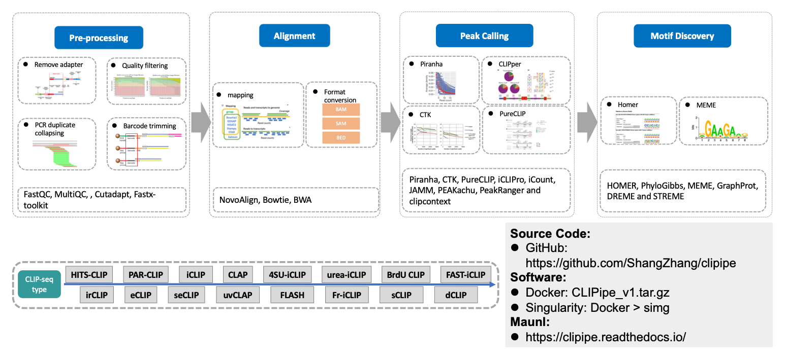

# CLIPipe

CLIPipe(CLIP-seq Pipeline) is an integrated pipeline for analyzing CLIP sequencing data.



The CLIPipe workflow consists of:

- Pre-processing function:
  - Quality control, remove adapter, filter low quality reads, collpase duplicates, remove barcode of the raw CLIP-seq data.

- Alignment function:
  - mapping sequencing data to reference genome using bowtie, bwa and novoalign

- Peak calling function:
  - Peak calling of the CLIP-seq data using Piranha, CTK, PureCLIP, iCLIPro, iCount, JAMM, PEAKachu, PeakRanger and clipcontext

- Motif discovery function:
  - Motif discovery of the CLIP-seq data using HOMER, PhyloGibbs, MEME, GraphProt, DREME and STREME

## Table of Contents:

- [Requirements](#requirements)
- [Installation](#installation)
- [Basic Usage](#basic-usage)
- [Usage](#usage)
  - [Pre-processing](#rre-processing)
  - [Alignment](#alignment)
  - [Peak calling](#peak-calling)
  - [Motif discovery](#motif-discovery)
- [Copyright and License Information](#copyright-and-license-information)
- [Citation](#citation)
- [Tutorial](tutorial/)

## Requirements
### Software
* docker

## Installation

1. All required software and packages are already installed in docker, so there are no more requirements. You can execute to get the docker `CLIPipe_v3` container:
  
    ```bash
    docker run --name=CLIPipe_v3 -t -d -h CLIPipe_docker --restart unless-stopped -v /lulab/lustre2/zhangshang/work/software/clipipe:/home/CLIPipe_user/clipipe zs/clipipe:v1 /bin/bash
    ```

2. To show the docker `CLIPipe_v3` container, you can execute:

   ```bash
   docker container ls
   ```

3. To execute the `CLIPipe_v3` container, you can execute:

   ```bash
   docker exec -it CLIPipe_v3 bash
   ```

4. After entering the container, please change the user to `CLIPipe_user`

   ```bash
   su CLIPipe_user;
   cd ~
   ```

5. To test the installation and get information about the command-line interface of CLIPipe, you can execute:

   ```bash
   clipipe --help
   ```

   A helper message is shown like this:

   ```
   usage: clipipe [-h] --user_config_file USER_CONFIG_FILE
                  {pre_process,mapping,peak_calling}
   
   CLIPipe: A comprehensive quality control and analysis pipeline for CLIP highthroughput sequencing data
   =======================================================================================================
   CLIPipe is a Python module and associated command-line interface (CLI), which provides all the
   commands needed to process protein-RNA CLIP interaction data and to identify and quantify
   sites of protein-RNA interactions on RNA.
   
   CLIPipe's main input are FASTQ files with iCLIP sequencing data, its main output are BED files
   with identified and quantified cross-linked sites.
   
   A number of analyses are included in CLIPipe that provide insights into the properties of
   protein-RNA interaction.
   
   positional arguments:
     {pre_process,mapping,peak_calling}
   
   optional arguments:
     -h, --help            show this help message and exit
     --user_config_file USER_CONFIG_FILE, -u USER_CONFIG_FILE
                           the user config file
   
   =======================================================================================================
   For additional help or support, please visit https://github.com/ShangZhang/clipipe
   ```

## Basic Usage
The basic usage of CLIPipe is:
```bash
clipipe ${step_name} -d ${dataset}
```

> **Note:**
>
> - `${step_name}` is one of the step listed in 'positional arguments'.
> - `${dataset}` is the name of your dataset that should match the prefix of your configuration file described in the following section.


## Usage

You can use the provided demo data to run CLIPipe:

```bash
cp /home/CLIPipe_user/clipipe/demo/general ${workspace}
```

The demo data folder has the following structure:
```
./
├── config
|   ├── default_config.yaml
│   └── user_config.yaml
├── data
|   ├── fastq/
│   └── sample_ids.txt
└── output
    └── ...
```

> **Note:**
> - `config/user_config.yaml`: configuration file with user defined parameters for each step. 
> - `config/default_config.yaml`: configuration file with additional detailed parameters for each step. The default file is not supposed to be changed unless you are very clear about what you are doing.
> - `config/fastq/`: folder of raw CLIP-seq fastq file.
> - `data/sample_ids.txt`: table of sample name information.
> - `output/example/`: output folder.

### Pre-processing

CLIPipe provides pre process step for raw CLIP-seq data. You needs to set up the `config/user_config.yaml` file correctly. The other parameters for pre process step can be found in `config/default_config.yaml`.

```bash
clipipe -u ./config/user_config.yaml pre_process
```

> **Note:**
> - The output folder `output/fastqc_raw/` contains quality control results of raw CLIP-seq data.
> - The output folder `output/multiqc_raw/` contains summary of all raw sequencing data quality control results.
> - The output folders `output/pre_process/` contain the pre process results of raw CLIP-seq data.

### Alignment

CLIPipe provides bowtie, bwa and novoalign for mapping CLIP-seq data. You need to set up the alignment tool in the `config/user_config.yaml` file correctly. It is **recommended** to specify the number of threads in `config/user_config.yaml` file by adding `threads_mapping: N`, or you can simply add `-j N` parameter in the CLIPipe command. The other detial parameters for alignment can be found in `config/default_config.yaml`.

```bash
clipipe -u ./config/user_config.yaml mapping
```

> **Note:**
> - The output folder `output/mapping_bowtie/` contains alignment results using bowtie.
> - The output folder `output/mapping_bwa/` contains alignment results using bwa.
> - The output folders `output/mapping_novoalign/` contain alignment results using novoalign.

### Peak calling

CLIPipe provides multi peak calling methods for identifying recurring fragments of CLIP-seq data. 

```bash
clipipe -u ./config/user_config.yaml peak_calling
```

> **Note:**
> - The output folders `output/peak_calling_piranha/` contain alignment results using piranha.
>
> - The output folder `output/peak_calling_CTK/` contains peak calling results using CTK.
> - The output folders `output/peak_calling_pureclip/` contain alignment results using pureclip.
> - The output folders `output/peak_calling_parclip_suite/` contain alignment results using parclip_suite.

Other peak calling tools can be used in the CLIPipe docker directily:

```bash
# iCLIPro
$ iCLIPro [options] in.bam

# iCount
$ iCount [-h] [-v] ...

# JAMM
$ ~/bin/miniconda3/envs/jamm/bin/JAMM.sh --help

# PEAKachu
$ peakachu [-h] [--version] {window,adaptive,coverage,consensus_peak} ...

# PeakRanger
$ peakranger <command> <arguments>

# clipcontext
$ clipcontext [-h] [-v] {g2t,t2g,lst,int,exb,eir} ...
```

### Motif discovery

The motif discovery function can be used directily in the CLIPipe docker:

```bash
# HOMER
$ homer [data] [parameters] -a [action]

# MEME
$ meme <dataset> [optional arguments]

# PhyloGibbs
$ phylogibbs-mp [-m motifwidth] input_seqfile [input_seqfile2 ...]

# STREME
$ streme [options]
```

## Copyright and License Information

Copyright (C) 2021 Tsinghua University, Beijing, China

This program is licensed with commercial restriction use license. Please see the [LICENSE](https://github.com/ShangZhang/clipipe/blob/main/LICENSE) file for details.


